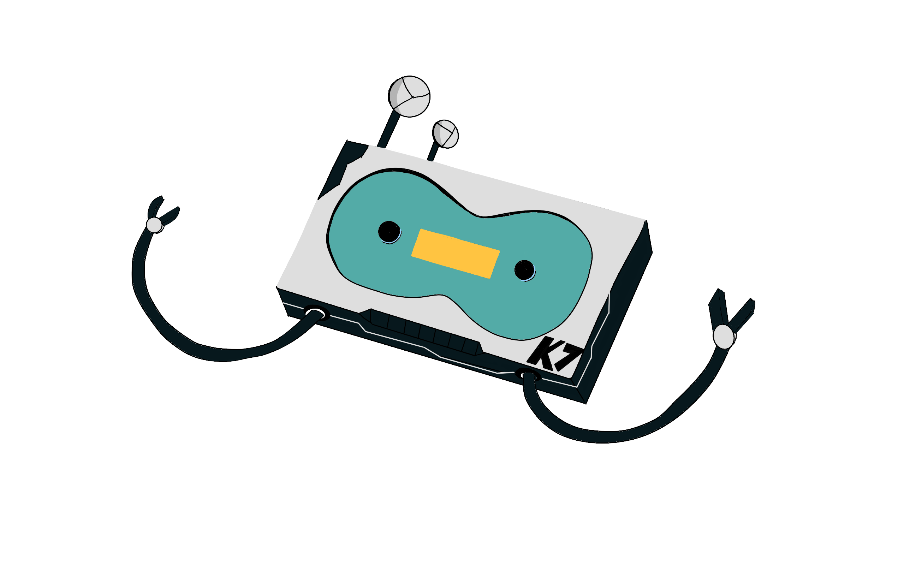
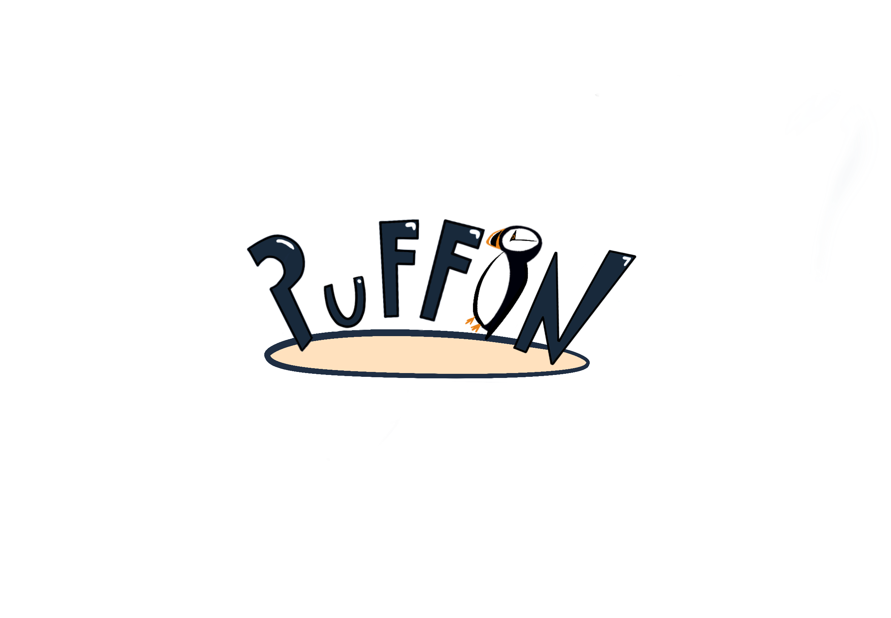

<p align="center">

</p>

# Cypherless

Cypherless is a 3D action-platformer and hacking game developed with Godot Engine 4.3. The project implements complex gameplay systems in C\#, ranging from a state-based artificial intelligence architecture to a modular combat system. This repository represents the technical culmination of Studio Puffin's work at EPITA.

## Technical Architecture

The project is built on a rigorous object-oriented architecture, prioritizing decoupling through the use of interfaces and the singleton pattern.

### Entity System and Artificial Intelligence

Actor behavior is driven by a modular architecture designed for scalability:

- **Entity Base**: Utilization of a parent class to standardize physics, health statistics, and damage handling through specialized interfaces.  
- **Finite State Machine (FSM)**: A robust implementation where each behavior (Patrol, Idle, Chase) is encapsulated in dedicated state classes, allowing for clean and extensible transition logic.  
- **3D Navigation**: Dynamic enemy pathfinding integrated within the state machine to handle complex environment traversal.

### Weaponry and Combat System

The combat system was designed to support multiple types of interactions, both ranged and melee:

- **Modular Weaponry**: A resource-based system to define weapon properties, enabling easy creation of new firearms or tools.  
- **Physical Projectiles**: Real projectile management with independent collision logic, moving away from simple hitscan for more tactical gameplay.  
- **Melee Interactions**: Specialized collision detection for bladed weapons to ensure precise combat feedback.  
- **Physics-Based Equipment**: Integrated weapon-throwing logic that allows active equipment to be transformed into makeshift projectiles based on player input.

### Hacking Architecture

The hacking system is a core technological pillar of the project, relying on strong abstraction to interact with the world:

- **Universal Interaction Contract**: A standardized interface ensures that any world object can be made interactive and hackable.  
- **Hackable Environment**: An abstraction layer used for diverse elements such as security barriers, transit systems, and electronic locks.  
- **Hacking Modules**: Implementation of distinct mini-games, including numeric keypads and animated Quick Time Event (QTE) sequences.

### Environment and Visual Effects

- **Dynamic Camera System**: Advanced tracking logic combined with procedural shake effects to enhance the visceral feel of combat and environmental hazards.  
- **User Interface (UI)**: Management of a comprehensive Heads-Up Display (HUD), featuring a dynamic dialogue system and reactive damage feedback effects.

## Multiplayer and Networking

The project integrates a networking solution for cooperative play:

- **Peer-to-Peer Architecture**: Robust connection management for hosting and joining remote sessions.  
- **State Synchronization**: Strategic use of Remote Procedure Calls (RPC) for critical events and synchronization nodes for smooth spatial transformations of networked players.

## Project Structure

- ```scripts/Entities/```: Logic for the player, allies, and various enemy types.  
- ```scripts/StateMachine/```: Core of the AI and behavior states.  
- ```scripts/Weapons/```: Base classes and specializations for firearms and melee weapons.  
- ```scripts/hacks/```: Interaction logic and hacking mini-games.  
- ```scripts/uis/```: Management of menus, inventory, and dialogue systems.

## Tech Stack

- Engine: Godot Engine 4.3 (.NET Edition)  
- Language: C\# 10 / .NET 6  
- Third-party tools: JetBrains Rider, Blender, Adobe Mixamo

## Installation

1. Ensure the .NET 6.0 SDK is installed on your machine.  
2. Clone the repository: git clone https://github.com/your-username/cypherless.git.  
3. Import the project into Godot Engine 4.3.  
4. Build the C\# solution via the MSBuild tab.  
5. Run the Game.tscn scene.

## Collaborators \- Studio Puffin

- **OS**: Project Lead, UI/UX.  
- **JV**: Web Development, Gameplay Systems, 3D Modeling.
- **NC (me)** : Graphics, 3D Animations, Technical Integration, Networking.
- **HS**: Audio, Narration, Sound Design.  
- **JVT**: Artificial Intelligence, Networking.  

<p align="center">

</p>
